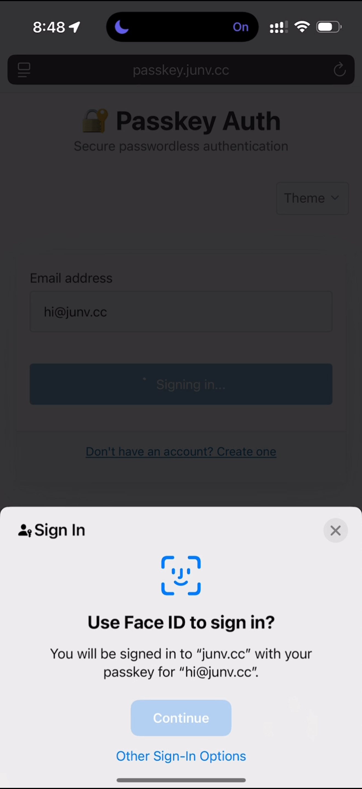

# 🔐 Passkey Auth for Kubernetes Nginx Ingress

A WebAuthn-based passkey authentication provider that integrates ingress controllers, currently support Kubernetes Nginx Ingress controller. Provides secure, passwordless authentication using passkeys (FIDO2/WebAuthn) as an auth backend for nginx ingress.

## TLDR;

Log in Apps without typing password or going through 3rd Party Oauth!

I use it for signing into my home lab apps.

## 🎬 Demo

<a href="https://giphy.com/gifs/vBeSrnuYUl3u1AQho6">
  
</a>

## ✨ Features

- **Passwordless Authentication**: Uses WebAuthn/FIDO2 passkeys for secure authentication
- **Nginx Ingress Integration**: Works as auth backend using nginx `auth_request` directive
- **User Management**: An simple Admin interface for managing users and approval status
- **Kubernetes Native**: Designed for Kubernetes deployment with persistent storage

## Security Benefits

- **No passwords stored** - Only WebAuthn public keys
- **Email-based access control** - Restrict registration to specific domains/emails
- **Phishing resistant** - WebAuthn is tied to the domain
- **MFA built-in** - Passkeys require user presence and verification
- **Session security** - Secure cookie-based sessions

## 🚀 Quick Start

### Using Helm Chart (Recommended)

```bash
# Add the Helm repository
helm repo add passkey-auth https://wahyd4.github.io/passkey-auth
helm repo update

# Install with your values
helm upgrade --install my-passkey-auth -n home-apps -f my-values.yaml  passkey-auth/passkey-auth
```

See the [Helm Chart README](helm/passkey-auth/README.md) for detailed configuration options.

### Test with Docker

```bash
docker run --name passkey-auth -d -p 8080:8080 -e ADMIN_EMAIL="admin@example.com"  ghcr.io/wahyd4/passkey-auth:main
```

### Local Development

```bash
# Install dependencies and run locally
go mod download
go run main.go

# Access at http://localhost:8080
```


### Setup Your App's Ingress

```yaml
apiVersion: networking.k8s.io/v1
kind: Ingress
metadata:
  name: your-app-ingress
  annotations:

    nginx.ingress.kubernetes.io/auth-url: "https://your-passkey-auth.com/auth"
    nginx.ingress.kubernetes.io/auth-signin: "https://your-passkey-auth.com/?redirect=https%3A%2F%2F$host$request_uri"
spec:
  rules:
  - host: your-app.com
    http:
      paths:
      - path: /
        pathType: Prefix
        backend:
          service:
            name: your-app-service
            port:
              number: 80
```


## 👥 User Management

Navigate to `https:///your-passkey-auth.com` to access the admin interface with three tabs:
- **Register User**: Register new users with passkeys
- **Test Login**: Test authentication
- **Manage Users**: View and manage all users with `ADMIN_USER` email address

### Configuration

```yaml
# config.yaml
auth:
  require_approval: true    # Require admin approval for new users
  allowed_emails:           # Email allowlist (empty = allow all)
    - "admin@company.com"
    - "user@company.com"
```
Check [config.example.yaml](./config.example.yaml) for more details

## 🔧 Development

### Local Development

```bash
# Install dependencies and run locally
go mod download
go run main.go

# Access at http://localhost:8080
```

### Key API Endpoints

| Endpoint | Method | Description |
|----------|--------|-------------|
| `/api/register/begin` | POST | Start passkey registration |
| `/api/register/finish` | POST | Complete passkey registration |
| `/api/login/begin` | POST | Start passkey authentication |
| `/api/login/finish` | POST | Complete passkey authentication |
| `/auth` | GET | Nginx auth check endpoint |
| `/api/users` | GET/POST | List/create users |
| `/health` | GET | Health check |


## 📄 License

Apache License 2.0
